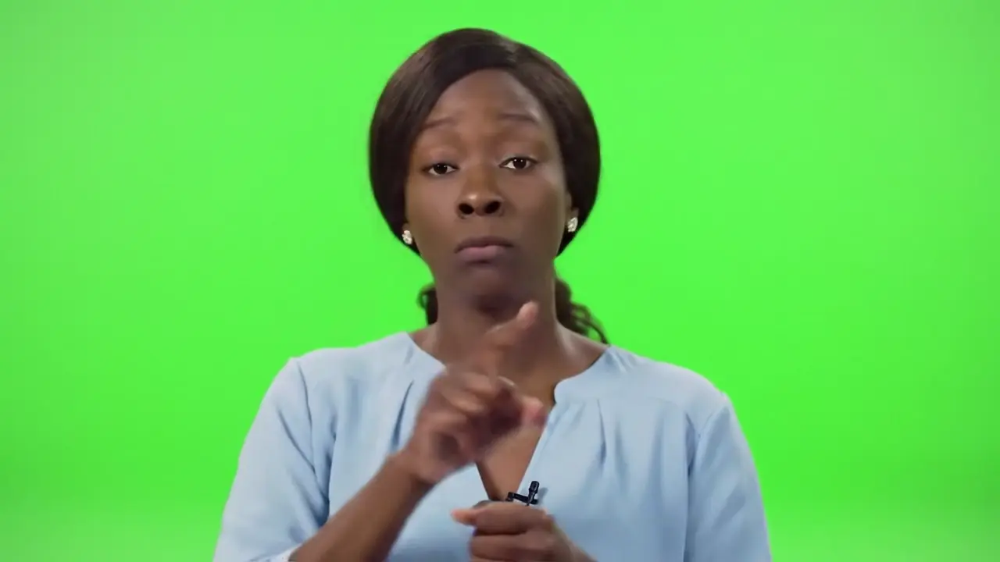
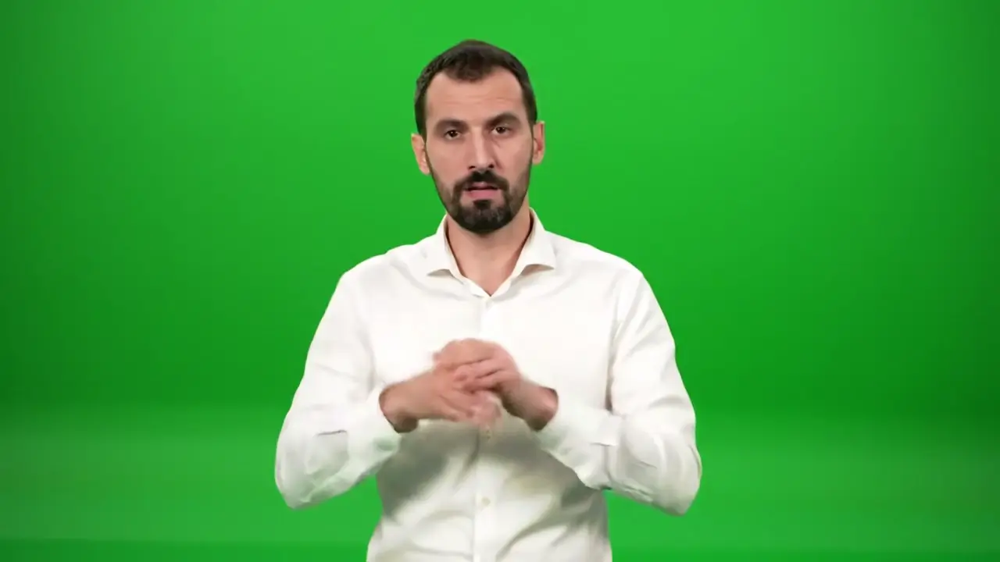
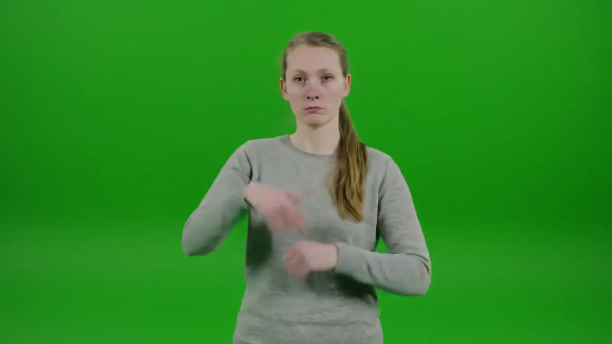
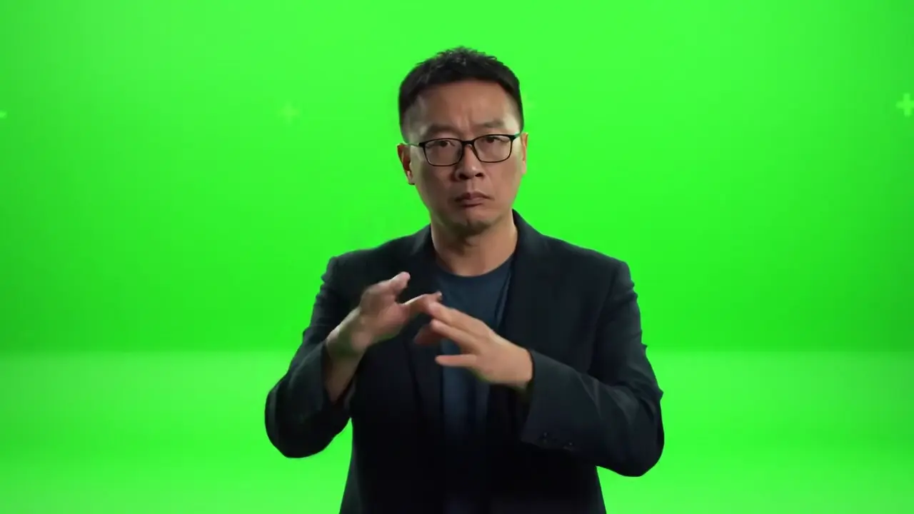
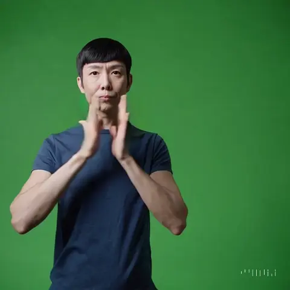
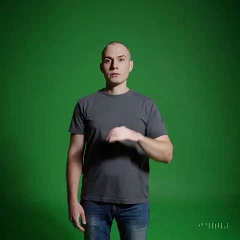
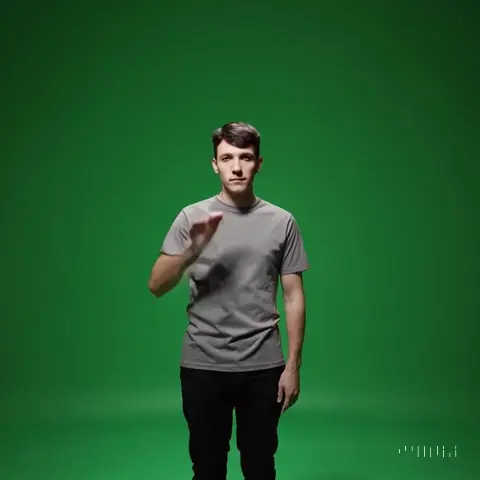
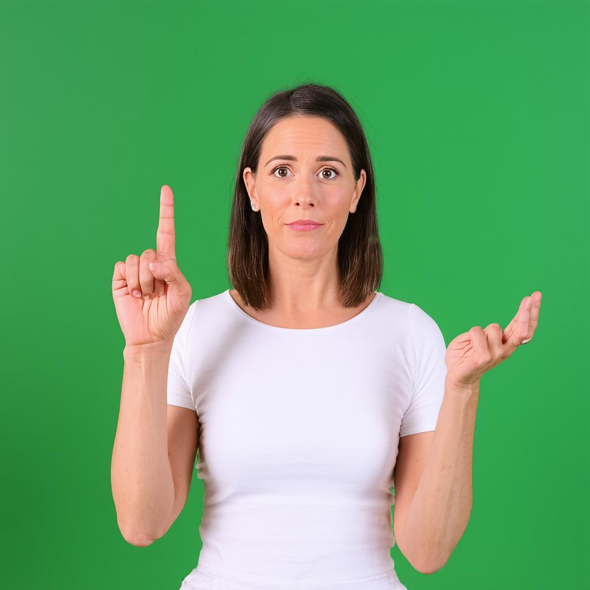

# State of the Art

We are often asked to explain why we are specifically building sign language technology,
given that large language models are currently improving rapidly.
Therefore, this document aims to provide a high-level overview of the current state of the art in popular vision-language models.

## Spoken to Signed Translation

### Video Generation Models

#### Google: Veo 2 (2025/05/10)

:::info Prompt
Sign language interpreter, green screen background, signing the American Sign Language sign for "House".
:::

| Video 1                                                            | Video 2                                                            |
| ------------------------------------------------------------------ | ------------------------------------------------------------------ |
|  |  |
|  |  |

#### OpenAI: [Sora](https://sora.com) (2024/12/14)

:::info Prompt
Sign language interpreter, green screen background, signing the American Sign Language sign for "House".
:::
:::tip Settings

- Aspect ratio: 1:1
- Resolution: 480p
- Duration: 5 seconds
- Quantity: 2
  :::

| Video 1                                                            | Video 2                                                            |
| ------------------------------------------------------------------ | ------------------------------------------------------------------ |
|  |  |

These examples show that the model is not able to generate a valid representation of the sign for "House".

However, if we ask the model to generate a specific movement (using [signwriting-description](https://github.com/sign-language-processing/signwriting-description)),
rather than a translation, the resulting motion seems to follow the description better.
Here is the prompt for "Hello" in American Sign Language:

:::info Prompt
Sign language interpreter, green screen background, performing an American Sign Language sign.
With your dominant hand open, touch your forehead and move your hand away, palm facing out.
:::

| Video 1                                                            | Video 2                                                            |
| ------------------------------------------------------------------ | ------------------------------------------------------------------ |
|  |  |

These results are more promising, as the model seems to follow the instructions. However, it seems like the instructions are under-specified,
and that the resulting videos are not a valid representation of the sign for "Hello".

### Image Generation Models

While video generation models are still in the horizon, image generation models are already mature.
Thus, we start by testing image generation models to generate an image of a sign.

#### OpenAI: [DALL-E 3](https://openai.com/index/dall-e-3/) via ChatGPT 4o (2024/12/08)

:::tip ChatGPT 4o Prompt
Sign language interpreter, green screen background, signing the American Sign Language sign for "House".
:::

To trigger DALL-E 3, ChatGPT 4o generates a new prompt:
:::info DALL-E 3 Prompt
A professional sign language interpreter signing the American Sign Language (ASL) sign for 'House' with clear and accurate hand positioning. The background is a plain green screen, suitable for chroma keying. The interpreter is dressed in neutral, professional attire, and the scene is well-lit to ensure clarity of the sign and facial expressions.
:::

The generated image is not a valid representation of the sign for "House".
The hands are with the wrong hand shapes, and they are not in the correct positions.

#### StabilityAI: [Stable Diffusion 3.5 Large](https://huggingface.co/stabilityai/stable-diffusion-3.5-large) (2024/12/08)

:::info Prompt
Sign language interpreter, green screen background, signing the American Sign Language sign for "House".
:::

The generated image is not a valid representation of the sign for "House".
The hands are with the wrong hand shapes, and they are not in the correct positions.

#### Google DeepMind: [Imagen 3](https://deepmind.google/technologies/imagen-3/) (2024/12/05)

The model refuses to generate images of sign language signs.

## Signed to Spoken Translation

### OpenAI

OpenAI does not currently support video inputs.

### Meta

Meta is conducting research on signed language translation, but their models are not publicly available.[^privacy-aware]
[^privacy-aware]: Rust et al. 2024. [Towards Privacy-Aware Sign Language Translation at Scale](https://arxiv.org/abs/2402.09611).

### Google (2024/12/08)

Google is conducting research on signed language translation, but their models are not publicly available.[^scaling-slt]
[^scaling-slt]: Zhang et al. 2024. [Scaling Sign Language Translation](https://arxiv.org/abs/2407.11855).

What is available, is [Gemini 1.5 Pro](https://console.cloud.google.com/vertex-ai/studio/freeform?model=gemini-1.5-pro-002), which is a general-purpose model which supports video inputs.

We attach a video of a woman signing "What is your name?"

:::info Prompt + Attached video "example-sentence.mp4"
Translate the attached American Sign Language video "example-sentence.mp4" into English.
:::

Responses:

1. The woman in the video signs the following: "I'm sorry, I don't understand."
2. The signer is saying: "Excuse me. I have a question."
3. The woman in the video signs the following: "Hello, my name is `[name]`. Nice to meet you."
4. The signer is saying: "Excuse me. Do you mind if I sit here?"
5. The signer is saying: "Excuse me. Do you have a second? Do you mind if I ask you a question?"

Using Gemini 2.0 Flash (2024/12/15), the model is not able to generate better translations:

1. 0:00-0:03: "Don't understand." ...
2. ... "Stop... I am thinking about this... I'm not sure." ...
3. ... the English translation is: Stop, I think I'm done?
4. ... English Translation: "I don't know."
5. ... In English, she is conveying the idea of "I don't understand."
